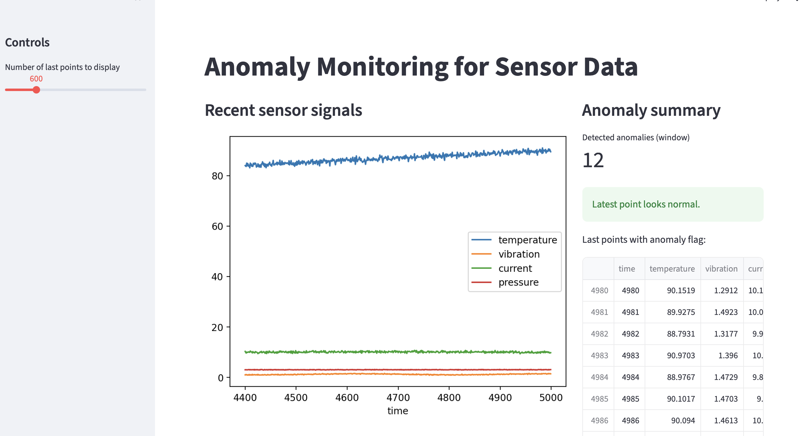

# Anomaly Monitoring for Sensor Data (Industrial / Defense)

## Objective
This project demonstrates a lightweight anomaly monitoring system for sensor-based platforms
(e.g. autonomous systems, robotics, industrial equipment).

The goal is to detect unusual behavior early in order to support preventive maintenance
and improve system reliability. The system is intended as a decision-support tool and does
not perform automated actions.

## Context and Use Case
Industrial and defense systems rely on multiple sensors to monitor the state of critical
equipment. Abnormal sensor behavior may indicate early signs of degradation or failure,
but such events are rare and difficult to detect manually.

This project illustrates how unsupervised machine learning can be used to detect anomalies
in multivariate sensor data and present the results in a simple monitoring interface.

## Data
The project uses synthetic sensor data generated locally to simulate realistic industrial
signals, including temperature, vibration, current and pressure measurements.

Synthetic data is used to avoid sensitive or proprietary datasets while allowing full control
over normal behavior and injected anomalies.

## Approach
- Generation of synthetic sensor data with noise and anomalies
- Unsupervised anomaly detection using an Isolation Forest model
- Scoring of each data point based on deviation from normal behavior
- Visualization and monitoring through a Streamlit dashboard

## Application Preview


## How to Run Locally

1. Generate synthetic sensor data:
```bash
python src/generate_data.py
Train the anomaly detection model:

bash
Copier le code
python src/train.py
Launch the Streamlit application:

bash
Copier le code
streamlit run app/app.py
The application will be available at:
http://localhost:8501

Limitations and Future Improvements
Sensor data is synthetic and not collected from real systems

Anomaly thresholds are generic and not calibrated with domain experts

No real-time streaming or alerting mechanism is implemented

Possible extensions include real-time data ingestion, alerting systems,
threshold calibration with engineering teams, and deployment on operational platforms.

Technologies
Python

pandas

numpy

scikit-learn

Streamlit